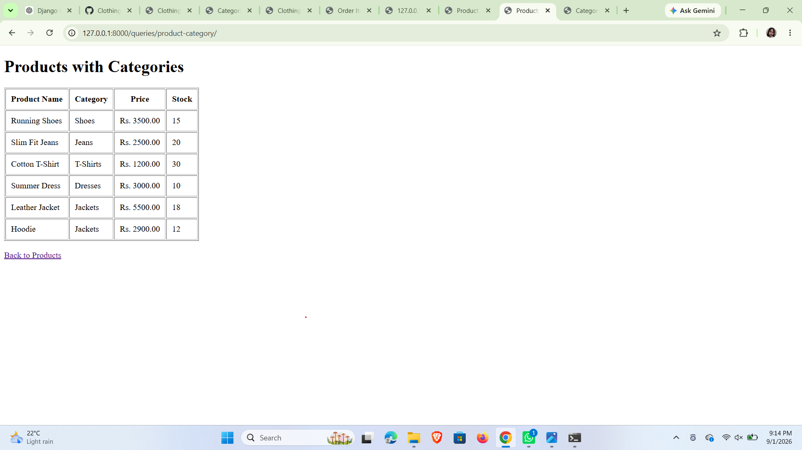
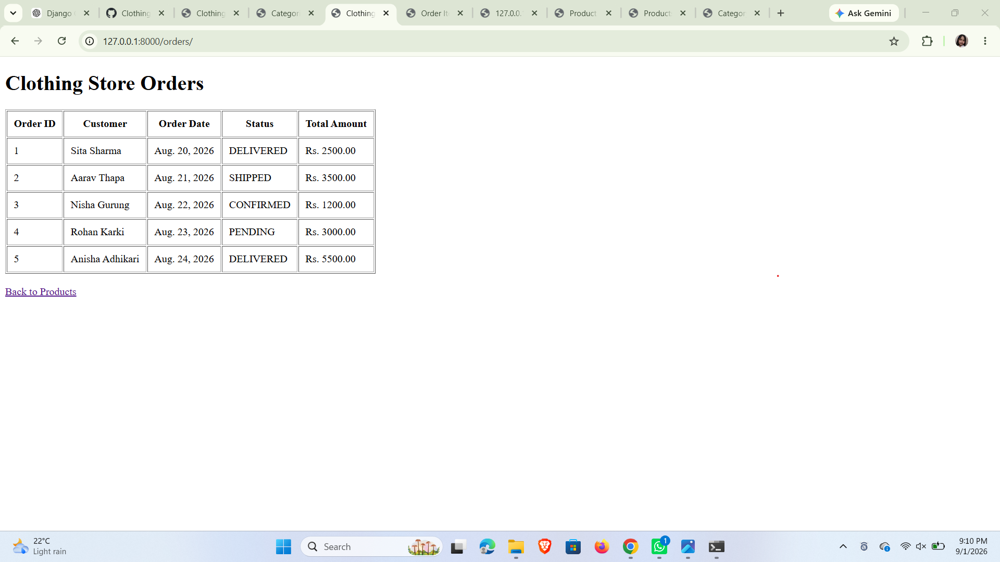
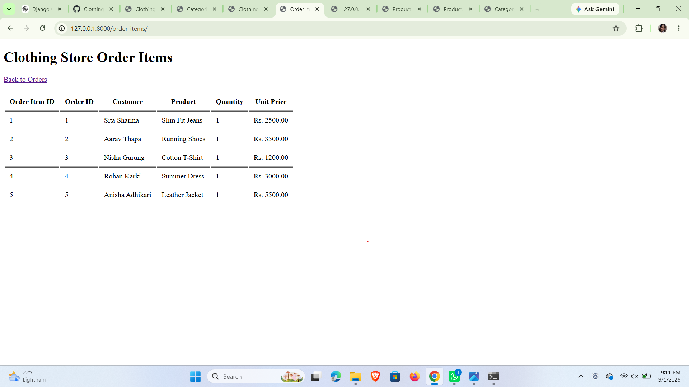
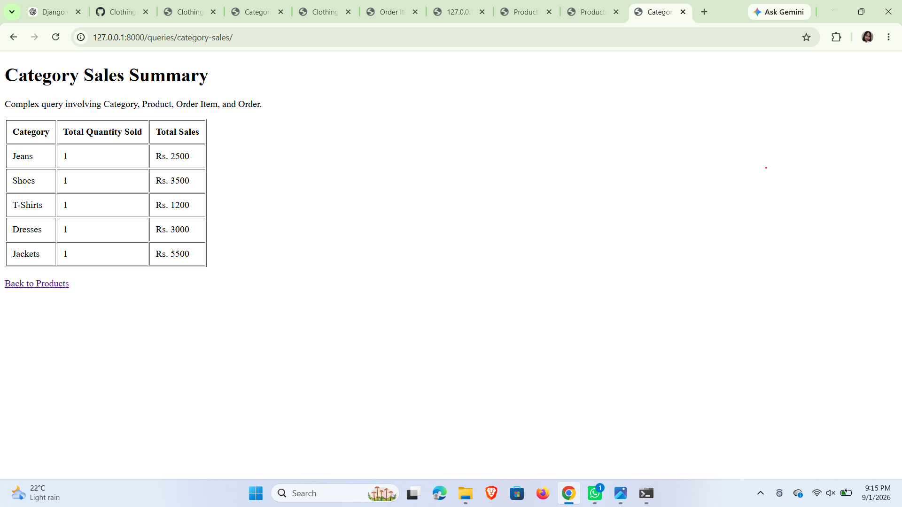
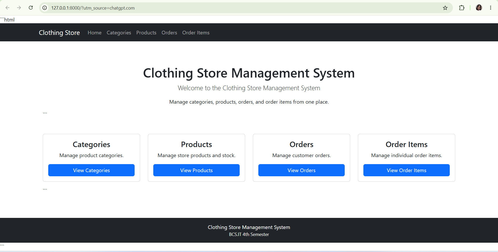
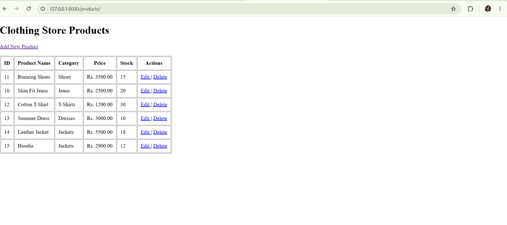
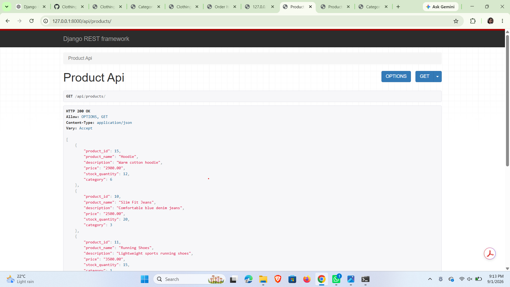
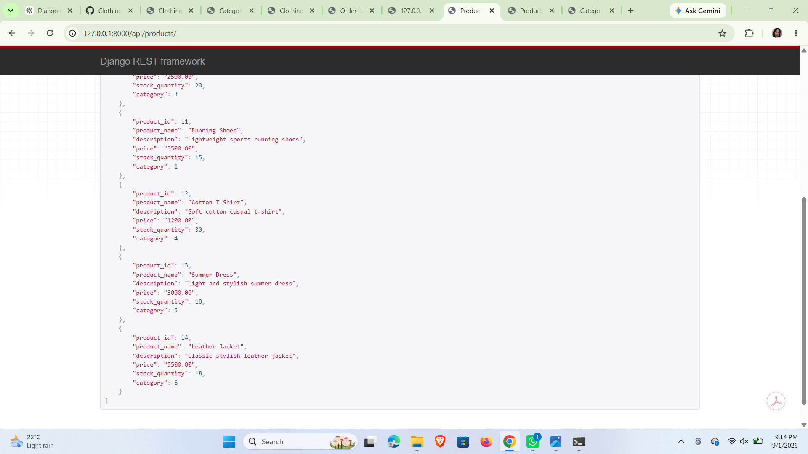
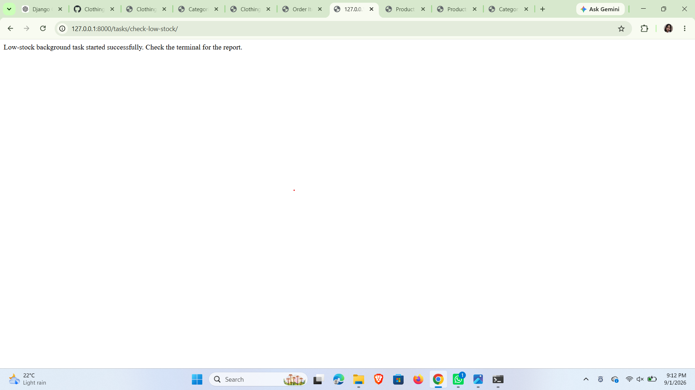

# Clothing Store Management System

**Name:** Sushma Kumari Chaudhary
**College:** KFA Business School & IT
**Course:** BCS.IT 4th Semester

**Project Title:** Clothing Store Management System
**Technology:** Python, Django, Oracle Database
**Academic Year:** 2026

---

## Table of Contents

1. [Introduction](#1-introduction)
2. [Objectives](#2-objectives)
3. [Technologies Used](#3-technologies-used)
4. [System Overview](#4-system-overview)
5. [Project Structure](#5-project-structure)
6. [Database Design](#6-database-design)
7. [Django Models and ORM Implementation](#7-django-models-and-orm-implementation)
8. [DTO/API Serializers and REST API Implementation](#8-dtoapi-serializers-and-rest-api-implementation)
9. [Business Service Layer and CRUD Operations](#9-business-service-layer-and-crud-operations)
10. [Related Queries and Complex Queries](#10-related-queries-and-complex-queries)
11. [Background/Asynchronous Task Implementation](#11-backgroundasynchronous-task-implementation)
12. [Web GUI / User Interface Implementation](#12-web-gui--user-interface-implementation)
13. [Testing and Results](#13-testing-and-results)
14. [Conclusion and Future Enhancements](#14-conclusion-and-future-enhancements)


---

## 1. Introduction

The Clothing Store Management System is a web-based enterprise application developed to manage the daily operations of a clothing store.

The system provides functionality for managing customers, product categories, products, orders, and order items. It uses Python Django as the web application framework and Oracle Database as the backend database.

The application follows a layered approach using Django models, services, serializers/API, views, templates, and database queries.

## 2. Objectives

The main objectives of the system are:

* To manage clothing store product information.
* To manage product categories.
* To manage customer orders.
* To manage order items and quantities.
* To perform CRUD operations on the main entities.
* To establish relationships between database tables.
* To implement queries involving multiple related entities.
* To implement complex business queries.
* To provide a REST API for products.
* To demonstrate a background/asynchronous task.
* To provide a user-friendly web-based graphical interface.
* To use Oracle Database for persistent data storage.

## 3. Technologies Used

| Technology            | Purpose                   |
| --------------------- | ------------------------- |
| Python                | Programming language      |
| Django                | Web application framework |
| Oracle Database       | Database management       |
| Django ORM            | Database interaction      |
| Django REST Framework | REST API                  |
| HTML                  | Web page structure        |
| CSS                   | Web page styling          |
| Bootstrap             | User interface design     |
| Git                   | Version control           |
| GitHub                | Project repository        |

## 4. System Overview

The system consists of five main entities:

1. Customer
2. Category
3. Product
4. Order
5. Order Item

These entities are connected through relationships. A customer can place multiple orders, a category can contain multiple products, and an order can contain multiple order items. Each order item is associated with a product.

The overall relationship can be represented as:

**Customer → Order → Order Item → Product → Category**

> **Figure 1: Entity Relationship Diagram (ERD)**
> *Diagram will be inserted here later.*

## 5. Project Structure

The Django project is organized into the following major components:

* `clothing_store/` – Main Django project configuration.
* `store/` – Main application containing models, views, services, serializers, tasks, URLs, and templates.
* `templates/store/` – HTML templates used by the web interface.
* `manage.py` – Django project management utility.
* `README.md` – Project overview and technology information.
* `REPORT.md` – Detailed assignment report.
## 6. Database Design

The Clothing Store Management System uses **Oracle Database** as its backend database. The database is designed using five main relational tables: `CUSTOMER`, `CATEGORY`, `PRODUCT`, `ORDERS`, and `ORDER_ITEM`.

These tables are connected using primary keys and foreign keys to maintain data integrity and represent the relationships between customers, products, categories, and orders.

### 6.1 Customer Table

The `CUSTOMER` table stores information about customers who purchase products from the clothing store.

| Column        | Description                         |
| ------------- | ----------------------------------- |
| `customer_id` | Unique identifier for each customer |
| `first_name`  | Customer's first name               |
| `last_name`   | Customer's last name                |
| `email`       | Customer's email address            |
| `phone`       | Customer's contact number           |
| `address`     | Customer's address                  |

**Primary Key:** `customer_id`

### 6.2 Category Table

The `CATEGORY` table stores product categories available in the clothing store.

| Column          | Description                         |
| --------------- | ----------------------------------- |
| `category_id`   | Unique identifier for each category |
| `category_name` | Name of the product category        |
| `description`   | Description of the category         |

**Primary Key:** `category_id`

Examples of categories include Shoes, Dresses, Shirts, Pants, and Accessories.

### 6.3 Product Table

The `PRODUCT` table stores information about products sold by the store.

| Column           | Description                           |
| ---------------- | ------------------------------------- |
| `product_id`     | Unique identifier for each product    |
| `product_name`   | Name of the product                   |
| `description`    | Product description                   |
| `category_id`    | Category to which the product belongs |
| `price`          | Selling price of the product          |
| `stock_quantity` | Available quantity in stock           |

**Primary Key:** `product_id`
**Foreign Key:** `category_id` references `CATEGORY(category_id)`

A category can contain multiple products, while each product belongs to one category.

### 6.4 Orders Table

The `ORDERS` table stores information about customer orders.

| Column         | Description                      |
| -------------- | -------------------------------- |
| `order_id`     | Unique identifier for each order |
| `customer_id`  | Customer who placed the order    |
| `order_date`   | Date of the order                |
| `order_status` | Current status of the order      |
| `total_amount` | Total value of the order         |

**Primary Key:** `order_id`
**Foreign Key:** `customer_id` references `CUSTOMER(customer_id)`

A customer can place multiple orders, while each order belongs to one customer.

### 6.5 Order Item Table

The `ORDER_ITEM` table stores individual products included in an order.

| Column          | Description                                  |
| --------------- | -------------------------------------------- |
| `order_item_id` | Unique identifier for each order item        |
| `order_id`      | Associated order                             |
| `product_id`    | Product included in the order                |
| `quantity`      | Quantity purchased                           |
| `unit_price`    | Price of the product at the time of purchase |

**Primary Key:** `order_item_id`
**Foreign Keys:**

* `order_id` references `ORDERS(order_id)`
* `product_id` references `PRODUCT(product_id)`

An order can contain multiple order items, and each order item represents a particular product purchased as part of that order.

### 6.6 Relationships Between Tables

The main relationships in the database are:

| Relationship          | Type        | Description                                |
| --------------------- | ----------- | ------------------------------------------ |
| Customer → Orders     | One-to-Many | One customer can place many orders         |
| Category → Product    | One-to-Many | One category can contain many products     |
| Orders → Order Items  | One-to-Many | One order can contain many order items     |
| Product → Order Items | One-to-Many | One product can appear in many order items |

The overall relationship is:

```text
CUSTOMER
   │
   │ 1
   │
   │ N
   ▼
 ORDERS
   │
   │ 1
   │
   │ N
   ▼
ORDER_ITEM
   ▲
   │ N
   │
   │ 1
   │
 PRODUCT
   ▲
   │ N
   │
   │ 1
   │
CATEGORY
```

> **Figure 2: Database Relationship Diagram**
> *Database diagram will be inserted here later.*

### 6.7 Database Design Summary

The database design separates information into related tables instead of storing all information in a single table. This reduces data duplication and makes the system easier to maintain.

Primary keys uniquely identify records, while foreign keys establish relationships between related entities. Django ORM is used by the application to interact with these Oracle database tables.
## 7. Django Models and ORM Implementation

Django's Object-Relational Mapping (ORM) is used to connect the application with the Oracle Database. Each database table is represented as a Django model, and relationships between tables are represented using Django relationship fields.

The main models used in the Clothing Store Management System are:

* `Customer`
* `Category`
* `Product`
* `Order`
* `OrderItem`

### 7.1 Customer Model

The `Customer` model represents the `CUSTOMER` database table. It stores the personal and contact information of customers.

```python
class Customer(models.Model):
    customer_id = models.IntegerField(primary_key=True)
    first_name = models.CharField(max_length=50)
    last_name = models.CharField(max_length=50)
    email = models.EmailField()
    phone = models.CharField(max_length=20)
    address = models.CharField(max_length=200)

    class Meta:
        db_table = 'CUSTOMER'
```

The `customer_id` field is used as the primary key.

### 7.2 Category Model

The `Category` model represents the `CATEGORY` table. It stores information about different product categories.

```python
class Category(models.Model):
    category_id = models.IntegerField(primary_key=True)
    category_name = models.CharField(max_length=100)
    description = models.CharField(max_length=255)

    class Meta:
        db_table = 'CATEGORY'
```

The `category_id` uniquely identifies each category.

### 7.3 Product Model

The `Product` model represents the `PRODUCT` table. Each product is associated with a category using a foreign key.

```python
class Product(models.Model):
    product_id = models.IntegerField(primary_key=True)
    product_name = models.CharField(max_length=100)
    description = models.CharField(max_length=255)
    category = models.ForeignKey(
        Category,
        on_delete=models.CASCADE
    )
    price = models.DecimalField(
        max_digits=10,
        decimal_places=2
    )
    stock_quantity = models.IntegerField()

    class Meta:
        db_table = 'PRODUCT'
```

The `category` foreign key establishes a **many-to-one relationship** between products and categories.

### 7.4 Order Model

The `Order` model represents the `ORDERS` table. It connects each order with the customer who placed it.

```python
class Order(models.Model):
    order_id = models.IntegerField(primary_key=True)
    customer = models.ForeignKey(
        Customer,
        on_delete=models.CASCADE
    )
    order_date = models.DateField()
    order_status = models.CharField(max_length=50)
    total_amount = models.DecimalField(
        max_digits=12,
        decimal_places=2
    )

    class Meta:
        db_table = 'ORDERS'
```

The `customer` foreign key establishes a relationship between customers and orders.

### 7.5 OrderItem Model

The `OrderItem` model represents the `ORDER_ITEM` table. It connects an order with the products purchased in that order.

```python
class OrderItem(models.Model):
    order_item_id = models.IntegerField(primary_key=True)
    order = models.ForeignKey(
        Order,
        on_delete=models.CASCADE
    )
    product = models.ForeignKey(
        Product,
        on_delete=models.CASCADE
    )
    quantity = models.IntegerField()
    unit_price = models.DecimalField(
        max_digits=10,
        decimal_places=2
    )

    class Meta:
        db_table = 'ORDER_ITEM'
```

The model contains two foreign keys:

* `order` connects the order item to an order.
* `product` connects the order item to a product.

### 7.6 ORM Relationships

The Django ORM represents the database relationships as follows:

```text
Customer
   │
   │ ForeignKey
   ▼
Order
   │
   │ ForeignKey
   ▼
OrderItem
   ▲
   │ ForeignKey
   │
Product
   ▲
   │ ForeignKey
   │
Category
```

These relationships allow related data to be retrieved using Django ORM without writing raw SQL for every operation.

### 7.7 Django ORM Queries

The application uses Django ORM for database operations.

For example, all categories can be retrieved using:

```python
categories = Category.objects.all()
```

Products can be retrieved together with their categories using:

```python
products = Product.objects.select_related('category').all()
```

Orders can be retrieved together with their customers using:

```python
orders = Order.objects.select_related('customer').all()
```

Order items can be retrieved together with their orders and products using:

```python
order_items = OrderItem.objects.select_related(
    'order',
    'product'
).all()
```

The application also uses aggregation functions such as `Sum()` and expressions using `F()` for complex database queries.

For example:

```python
total_quantity = Sum('product__orderitem__quantity')
```

This demonstrates how Django ORM can perform relational queries and aggregation across multiple related tables.

### 7.8 Advantages of Using Django ORM

The use of Django ORM provides several advantages:

1. It reduces the need to write raw SQL queries.
2. It provides a Python-based interface for database operations.
3. It supports relationships between database tables.
4. It provides built-in query methods such as `filter()`, `get()`, `all()`, and `select_related()`.
5. It supports aggregation and complex queries.
6. It improves code readability and maintainability.
7. It allows the Django application to communicate with the Oracle Database through the configured database backend.

### 7.9 ORM Implementation Summary

The Django models provide the application layer representation of the Oracle database tables. Primary keys and foreign keys maintain relationships between entities, while Django ORM provides methods for creating, retrieving, updating, and deleting records.

Therefore, the model and ORM layer acts as an important connection between the **Django web application** and the **Oracle Database**.
## 8. DTO/API Serializers and REST API Implementation

The Clothing Store Management System uses **Django REST Framework (DRF)** to provide an API for product data. The serializer converts Django model objects into a format that can be transmitted through an API, such as JSON.

This layer acts as a bridge between the Django model and the API response.

### 8.1 Product Serializer

A `ProductSerializer` is used to serialize product objects.

The serializer is defined in the `serializers.py` file:

```python
from rest_framework import serializers
from .models import Product


class ProductSerializer(serializers.ModelSerializer):

    class Meta:
        model = Product
        fields = '__all__'
```

The `ModelSerializer` automatically creates serializer fields based on the `Product` model.

The following product information can therefore be returned through the API:

* Product ID
* Product name
* Description
* Category
* Price
* Stock quantity

### 8.2 Product API View

The application provides a GET API endpoint for retrieving product information.

The API view is implemented as follows:

```python
from rest_framework.decorators import api_view
from rest_framework.response import Response
from .serializers import ProductSerializer


@api_view(['GET'])
def product_api(request):
    products = Product.objects.all()
    serializer = ProductSerializer(products, many=True)

    return Response(serializer.data)
```

The view performs the following operations:

1. Retrieves all products from the database using Django ORM.
2. Passes the products to `ProductSerializer`.
3. Converts the model objects into serialized data.
4. Returns the serialized data as a JSON response.

### 8.3 API URL

The product API is connected to the following URL pattern in `store/urls.py`:

```python
path(
    'api/products/',
    views.product_api,
    name='product_api'
),
```

Therefore, the API can be accessed at:

```text
http://127.0.0.1:8000/api/products/
```

### 8.4 API Response

When the endpoint is accessed using a web browser or an API testing tool, the API returns product information in JSON format.

Example:

```json
[
    {
        "product_id": 10,
        "product_name": "Running Shoes",
        "description": "Comfortable running shoes",
        "category": 1,
        "price": "2500.00",
        "stock_quantity": 20
    }
]
```

The actual values depend on the records stored in the Oracle Database.

### 8.5 DTO Concept

A **Data Transfer Object (DTO)** is used to represent data that is transferred between different parts of an application.

In this project, the Django REST Framework serializer performs a similar data-transfer role by converting Django model instances into API-friendly data.

The flow can be represented as:

```text
Oracle Database
       ↓
Django Model
       ↓
Django ORM
       ↓
ProductSerializer
       ↓
JSON Response
       ↓
Client / Browser / API Tool
```

### 8.6 API Endpoint Summary

| HTTP Method | Endpoint         | Purpose               |
| ----------- | ---------------- | --------------------- |
| GET         | `/api/products/` | Retrieve all products |

The API currently provides a read-only product endpoint using the HTTP `GET` method.

### 8.7 Benefits of the API Layer

The REST API provides several benefits:

* Allows external clients to retrieve product information.
* Separates data representation from the database model.
* Provides JSON-formatted data.
* Makes the application easier to integrate with other systems.
* Demonstrates the use of Django REST Framework.
* Provides a foundation for developing additional API operations in the future.

### 8.8 API Implementation Summary

The serializer and API layer demonstrate how the Clothing Store Management System can expose database information to external clients.

The `ProductSerializer` converts product model instances into JSON-compatible data, while the `product_api` view retrieves product records through Django ORM and returns them through the REST API.
## 9. Business Service Layer and CRUD Operations

The Clothing Store Management System uses a business service layer to separate business logic from the Django views. This improves the organization, readability, and maintainability of the application.

The service layer is responsible for handling operations related to products, while Django views are responsible for handling HTTP requests and rendering templates.

### 9.1 Business Service Layer

The project contains a `services.py` file where business-related operations are implemented.

The `ProductService` is used by the product views to retrieve product information.

Example:

```python
class ProductService:

    @staticmethod
    def get_all_products():
        return Product.objects.all()
```

The product list view calls the service layer instead of directly retrieving the products:

```python
def product_list(request):
    products = ProductService.get_all_products()

    return render(request, 'store/product_list.html', {
        'products': products
    })
```

This creates a separation between the presentation layer and the business/data access logic.

### 9.2 CRUD Operations

CRUD stands for:

* **Create** – Add a new record.
* **Read** – Retrieve existing records.
* **Update** – Modify an existing record.
* **Delete** – Remove a record.

CRUD functionality has been implemented for the main entities of the system.

### 9.3 Category CRUD

The system provides complete CRUD operations for categories.

| Operation | URL                                 | Function          |
| --------- | ----------------------------------- | ----------------- |
| Create    | `/categories/create/`               | `category_create` |
| Read      | `/categories/`                      | `category_list`   |
| Update    | `/categories/<category_id>/edit/`   | `category_update` |
| Delete    | `/categories/<category_id>/delete/` | `category_delete` |

The category list retrieves all categories using:

```python
categories = Category.objects.all()
```

A new category is created using:

```python
Category.objects.create(
    category_name=category_name,
    description=description
)
```

### 9.4 Product CRUD

The system provides complete CRUD operations for products.

| Operation | URL                              | Function         |
| --------- | -------------------------------- | ---------------- |
| Create    | `/products/add/`                 | `product_create` |
| Read      | `/products/`                     | `product_list`   |
| Update    | `/products/edit/<product_id>/`   | `product_update` |
| Delete    | `/products/delete/<product_id>/` | `product_delete` |

The product creation process receives information from the HTML form and creates a product record in the database.

```python
Product.objects.create(
    product_id=product_id,
    product_name=product_name,
    description=description,
    category_id=category_id,
    price=price,
    stock_quantity=stock_quantity
)
```

For updating a product, the existing object is retrieved and its fields are modified:

```python
product = get_object_or_404(
    Product,
    product_id=product_id
)

product.product_name = request.POST.get('product_name')
product.price = request.POST.get('price')
product.stock_quantity = request.POST.get('stock_quantity')

product.save()
```

For deleting a product:

```python
product.delete()
```

### 9.5 Order CRUD

The system also provides CRUD functionality for customer orders.

| Operation | URL                          | Function       |
| --------- | ---------------------------- | -------------- |
| Create    | `/orders/add/`               | `order_create` |
| Read      | `/orders/`                   | `order_list`   |
| Update    | `/orders/edit/<order_id>/`   | `order_update` |
| Delete    | `/orders/delete/<order_id>/` | `order_delete` |

Orders are connected to customers using a foreign key.

The order list uses `select_related()` to retrieve related customer information efficiently:

```python
orders = Order.objects.select_related(
    'customer'
).all()
```

### 9.6 Order Item CRUD

CRUD operations are also implemented for order items.

| Operation | URL                                    | Function            |
| --------- | -------------------------------------- | ------------------- |
| Create    | `/order-items/add/`                    | `order_item_create` |
| Read      | `/order-items/`                        | `order_item_list`   |
| Update    | `/order-items/edit/<order_item_id>/`   | `order_item_update` |
| Delete    | `/order-items/delete/<order_item_id>/` | `order_item_delete` |

The order item list retrieves related order and product information:

```python
order_items = OrderItem.objects.select_related(
    'order',
    'product'
).all()
```

### 9.7 Use of `get_object_or_404()`

The application uses Django's `get_object_or_404()` function when retrieving individual records.

For example:

```python
product = get_object_or_404(
    Product,
    product_id=product_id
)
```

This retrieves the requested product if it exists. If the product does not exist, Django automatically returns an HTTP 404 response.

This provides safer handling of invalid or non-existing record IDs.

### 9.8 CRUD Workflow

The general CRUD workflow of the application is:

```text
User
 ↓
HTML Form / Web Interface
 ↓
Django View
 ↓
Business Service / Django ORM
 ↓
Oracle Database
 ↓
Response
 ↓
Web Interface
```

### 9.9 CRUD Implementation Summary

The system implements CRUD operations for the main transactional entities and provides a web interface through which users can manage records.

The service layer helps separate business logic from views, while Django ORM provides the database interaction. Together, these components create a structured enterprise application architecture.

The implementation demonstrates the complete lifecycle of records from creation and retrieval to modification and deletion.
## 10. Related Queries and Complex Queries

The Clothing Store Management System implements several related and complex database queries using Django ORM. These queries demonstrate how information can be retrieved from multiple related entities.

The project includes three related queries and two complex queries involving multiple entities, satisfying the requirement for multi-table database operations.

### 10.1 Product–Category Query

The Product–Category query retrieves product information together with its associated category.

The query is implemented using Django ORM:

```python id="q1pca"
products = Product.objects.select_related(
    'category'
).all()
```

The `select_related()` method follows the foreign key relationship between `Product` and `Category`.

The query provides information such as:

* Product ID
* Product name
* Category
* Price
* Stock quantity

The relationship can be represented as:

```text id="m2pcq"
CATEGORY
    │
    │ 1
    │
    │ N
    ▼
PRODUCT
```

The result is displayed through the `product_category_query.html` template.

**URL:**

```text id="n8pcq"
/queries/product-category/
```

---
**Figure 10.1: Product–Category Query Result**


### 10.2 Order–Customer Query

The Order–Customer query retrieves orders together with the customers who placed them.

The query uses:

```python id="r6ocq"
orders = Order.objects.select_related(
    'customer'
).all()
```

The query follows the foreign key relationship between `Order` and `Customer`.

The result contains information such as:

* Order ID
* Customer ID
* Customer name
* Order date
* Order status
* Total amount

The relationship is:

```text id="x7ocq"
CUSTOMER
    │
    │ 1
    │
    │ N
    ▼
 ORDERS
```

**URL:**

```text id="j3ocq"
/queries/order-customer/
```

---
**Figure 10.2: Order–Customer Query Result**



### 10.3 Order Item Details Query

The Order Item Details query retrieves order item information together with the related order, customer, and product.

The Django ORM query is:

```python id="z4oid"
order_items = OrderItem.objects.select_related(
    'order__customer',
    'product'
).all()
```

This query follows multiple relationships in a single operation.

The query connects:

```text id="u8oid"
CUSTOMER
    │
    ▼
 ORDERS
    │
    ▼
ORDER_ITEM
    ▲
    │
    ▼
 PRODUCT
```

The resulting information can include:

* Order item ID
* Order ID
* Customer information
* Product information
* Quantity
* Unit price

**URL:**

```text id="f5oid"
/queries/order-item-details/
```

---
**Figure 10.3: Order Item Details Query Result**



## 10.4 Complex Query: Customer Purchases

The Customer Purchases query is a complex query involving multiple related entities.

It retrieves order item records together with the customer and product associated with each purchase.

The query is:

```python id="c7cpq"
order_items = OrderItem.objects.select_related(
    'order__customer',
    'product'
).all()
```

The query involves three main entities:

* Customer
* Order
* Order Item
* Product

The relationship can be represented as:

```text id="a3cpq"
CUSTOMER
    │
    ▼
  ORDER
    │
    ▼
ORDER_ITEM
    │
    ▼
 PRODUCT
```

This query allows the system to display which customer purchased which product and the quantity purchased.

The query can be used to analyze customer purchasing information.

**URL:**

```text id="b6cpq"
/queries/customer-purchases/
```

---
**Figure 10.4: Customer Purchases Query Result**


## 10.5 Complex Query: Category Sales

The Category Sales query calculates the total quantity sold and total sales amount for products belonging to each category.

This is implemented using Django ORM aggregation:

```python id="v9csq"
categories = Category.objects.annotate(
    total_quantity=Sum(
        'product__orderitem__quantity'
    ),
    total_sales=Sum(
        ExpressionWrapper(
            F('product__orderitem__quantity') *
            F('product__orderitem__unit_price'),
            output_field=DecimalField(
                max_digits=12,
                decimal_places=2
            )
        )
    )
)
```

This query uses:

* `annotate()` to add calculated values.
* `Sum()` to calculate totals.
* `F()` expressions to reference database fields.
* `ExpressionWrapper()` to perform arithmetic operations.
* `DecimalField()` to define the output type.

The calculation for total sales is:

```text id="d2cst"
Total Sales = Quantity × Unit Price
```

The query involves multiple entities:

```text id="h5cst"
CATEGORY
    │
    ▼
 PRODUCT
    │
    ▼
ORDER_ITEM
```

The resulting data includes:

* Category name
* Total quantity sold
* Total sales amount

This query provides useful business information for identifying sales performance by category.

**URL:**

```text id="k7cst"
/queries/category-sales/
```

---
**Figure 10.5: Category Sales Query Result**



## 10.6 Query Summary

The implemented queries can be summarized as follows:

| Query              | Entities Involved                    | Purpose                                 | Type          |
| ------------------ | ------------------------------------ | --------------------------------------- | ------------- |
| Product–Category   | Product, Category                    | Display products with categories        | Related Query |
| Order–Customer     | Order, Customer                      | Display orders with customers           | Related Query |
| Order Item Details | Order Item, Order, Customer, Product | Display detailed order item information | Related Query |
| Customer Purchases | Customer, Order, Order Item, Product | Analyze customer purchases              | Complex Query |
| Category Sales     | Category, Product, Order Item        | Calculate category sales                | Complex Query |

## 10.7 Importance of Related and Complex Queries

These queries demonstrate the ability of Django ORM to work with related database entities without requiring raw SQL for each operation.

The queries provide useful business information such as:

* Products belonging to each category.
* Orders placed by customers.
* Products purchased in individual orders.
* Customer purchasing information.
* Total quantity sold by category.
* Total sales generated by each category.

Therefore, the query layer demonstrates the use of relationships, joins, aggregation, and calculated expressions within the enterprise application.
## 11. Background/Asynchronous Task Implementation

The Clothing Store Management System includes a background task for checking products with low stock quantities.

The purpose of this task is to identify products whose available stock has fallen below a specified level. This helps the store administrator monitor inventory and identify products that may need to be restocked.

### 11.1 Low-Stock Task

The background task is implemented in the `tasks.py` file.

The task is responsible for checking product stock levels and generating a low-stock report.

The task can be executed using the following function:

```python
run_low_stock_task()
```

The task operates separately from the normal CRUD operations of the application.

### 11.2 Triggering the Task

A Django view is provided to trigger the low-stock task from the web application.

The implementation is:

```python
from django.http import HttpResponse
from .tasks import run_low_stock_task


def trigger_low_stock_task(request):
    run_low_stock_task()

    return HttpResponse(
        "Low-stock background task started successfully. "
        "Check the terminal for the report."
    )
```

When this view is accessed, the `run_low_stock_task()` function is executed.

### 11.3 Task URL

The task is registered in `store/urls.py` using the following URL pattern:

```python
path(
    'tasks/check-low-stock/',
    views.trigger_low_stock_task,
    name='trigger_low_stock_task'
),
```

Therefore, the task can be triggered through:

```text
http://127.0.0.1:8000/tasks/check-low-stock/
```

### 11.4 Task Workflow

The low-stock task follows this workflow:

```text
User
  ↓
Low-Stock Task URL
  ↓
Django View
  ↓
run_low_stock_task()
  ↓
Check Product Stock
  ↓
Generate Low-Stock Report
  ↓
Terminal Output
```

### 11.5 Purpose of the Background Task

The low-stock task provides an example of background processing in the enterprise application.

It can be used to:

* Monitor product inventory.
* Identify products with insufficient stock.
* Generate a low-stock report.
* Assist store administrators in making restocking decisions.
* Separate inventory monitoring from normal CRUD operations.

### 11.6 Django Task Configuration

The project is configured with Django's task system. The configured task backend in the development environment executes tasks immediately.

This configuration allows the task functionality to be demonstrated without requiring an additional external task broker during development.

The task can later be extended to use a production background-task system if required.

### 11.7 Task Testing

The low-stock task was tested through the web application using the task URL.

After accessing the endpoint, the browser displays a confirmation message indicating that the low-stock task has started successfully.

The task output can be observed in the Django development server terminal.

> **Figure 3: Low-Stock Task Execution**
> *Screenshot of the successful task execution will be inserted here later.*

### 11.8 Background Task Summary

The low-stock monitoring feature demonstrates how an enterprise application can perform a separate inventory-related processing task.

The implementation uses a dedicated task function, a Django view for triggering the task, and a URL endpoint for accessing the functionality through the web application.
## 12. Web GUI / User Interface Implementation

The Clothing Store Management System provides a web-based graphical user interface (GUI) developed using Django templates, HTML, CSS, and Bootstrap. The GUI allows users to interact with the database through a simple and user-friendly interface without directly executing SQL commands.

### 12.1 Home Page

The system provides a home page that acts as the main entry point of the application. It provides navigation to the major sections of the Clothing Store Management System.

The home page includes links to:

* Category Management
* Product Management
* Order Management
* Order Item Management
* Related Queries
* Complex Queries
* Product REST API
* Low-Stock Background Task

**Figure 12.1: Home Page**



### 12.2 Category Management

The Category Management interface provides CRUD operations for product categories.

The user can:

* View all categories
* Add a new category
* Edit an existing category
* Delete a category

The following Django templates are used:

* `category_list.html`
* `category_form.html`
* `category_confirm_delete.html`

---

### 12.3 Product Management

The Product Management interface allows users to manage products stored in the Oracle database.

The user can:

* View all products
* Add a new product
* Edit product information
* Delete products
* View products together with their categories

The following templates are used:

* `product_list.html`
* `product_create.html`
* `product_update.html`
* `product_confirm_delete.html`
* `product_category_query.html`

The product interface also demonstrates the relationship between the Product and Category entities.

**Figure 12.2: Product Management Interface**



### 12.4 Order Management

The Order Management interface provides CRUD functionality for customer orders.

The user can:

* View orders
* Create new orders
* Update existing orders
* Delete orders
* View orders together with customer information

The following templates are used:

* `order_list.html`
* `order_create.html`
* `order_update.html`
* `order_confirm_delete.html`
* `order_customer_query.html`

The interface demonstrates the relationship between the Customer and Order entities.

---

### 12.5 Order Item Management

Order items represent individual products included in an order.

The interface allows users to:

* View order items
* Add order items
* Update order items
* Delete order items
* Select an existing order
* Select an existing product
* View detailed order-item information

The following templates are used:

* `order_item_list.html`
* `order_item_create.html`
* `order_item_update.html`
* `order_item_confirm_delete.html`
* `order_item_details_query.html`

This interface demonstrates the relationships between Order, Product, and OrderItem entities.

---

### 12.6 Related Query Interfaces

The system includes several pages for displaying related data from multiple database tables.

The implemented related queries include:

1. Products with their categories
2. Orders with their customers
3. Order items with order and product details

These queries use Django ORM relationship features such as `select_related()` to efficiently retrieve related objects.

The query pages provide a user-friendly way to view related information without directly writing SQL queries.

---

### 12.7 Complex Query Interfaces

The system also provides complex query pages involving multiple related entities.

The implemented complex queries include:

* Customer purchase information
* Category-wise sales information

The customer purchase query combines information from Customer, Order, OrderItem, and Product.

The category sales query calculates:

* Total quantity sold
* Total sales amount

Django ORM aggregation functions such as `Sum()`, `F()`, and `ExpressionWrapper()` are used to perform these calculations.

The results are displayed through dedicated Django templates.

---

### 12.8 REST API Interface

A REST API endpoint has been implemented for retrieving product information.

The API endpoint is:

```text
/api/products/
```

The endpoint returns product data in JSON format using Django REST Framework and the `ProductSerializer`.

This provides a machine-readable interface that can be used by other applications or frontend systems.

---

### 12.9 Low-Stock Task Interface

The system includes a web endpoint for triggering the low-stock background task.

The endpoint is:

```text
/tasks/check-low-stock/
```

When the endpoint is accessed, the low-stock task is executed and a confirmation message is returned.

The task checks product stock levels and generates a low-stock report in the terminal.

---

### 12.10 Navigation and Common Layout

A common `base.html` template is used to maintain a consistent layout throughout the application.

Individual pages extend the base template using Django template inheritance.

This approach provides:

* Consistent navigation
* Reusable HTML structure
* Reduced code duplication
* Consistent styling
* Easier maintenance

The main templates used in the project include:

```text
base.html
category_list.html
category_form.html
category_confirm_delete.html
product_list.html
product_create.html
product_update.html
product_confirm_delete.html
order_list.html
order_create.html
order_update.html
order_confirm_delete.html
order_item_list.html
order_item_create.html
order_item_update.html
order_item_confirm_delete.html
product_category_query.html
order_customer_query.html
order_item_details_query.html
customer_purchase_complex_query.html
category_sales_complex_query.html
```

### 12.11 Summary

The web GUI provides a complete interface for interacting with the Clothing Store Management System. It connects the Django application layer with the Oracle database and provides CRUD operations, related queries, complex queries, REST API access, and background task functionality through a browser-based interface.

Screenshots of the major interfaces will be added to this section as evidence of the implemented system.
## 13. Testing and Results

Testing was performed to verify that the Clothing Store Management System works correctly and that the implemented features interact successfully with the Oracle database. The Django development server was used to test the web-based functionality through a browser.

### 13.1 Testing Approach

The system was tested using functional testing. Each major feature was accessed through the web interface and the resulting output was checked.

The main areas tested were:

* Oracle database connectivity
* Category CRUD operations
* Product CRUD operations
* Order CRUD operations
* Order Item CRUD operations
* Related queries
* Complex queries
* REST API
* Background task
* Web navigation and templates

### 13.2 CRUD Operation Testing

| Module     | Operation | Expected Result                                | Result     |
| ---------- | --------- | ---------------------------------------------- | ---------- |
| Category   | Create    | New category is stored in the database         | Successful |
| Category   | Read      | Categories are displayed correctly             | Successful |
| Category   | Update    | Existing category information is updated       | Successful |
| Category   | Delete    | Selected category is removed                   | Successful |
| Product    | Create    | New product is stored in the database          | Successful |
| Product    | Read      | Products are displayed correctly               | Successful |
| Product    | Update    | Existing product information is updated        | Successful |
| Product    | Delete    | Selected product is removed                    | Successful |
| Order      | Create    | New order is stored in the database            | Successful |
| Order      | Read      | Orders are displayed with customer information | Successful |
| Order      | Update    | Existing order information is updated          | Successful |
| Order      | Delete    | Selected order is removed                      | Successful |
| Order Item | Create    | New order item is stored                       | Successful |
| Order Item | Read      | Order items are displayed correctly            | Successful |
| Order Item | Update    | Existing order item is updated                 | Successful |
| Order Item | Delete    | Selected order item is removed                 | Successful |

### 13.3 Related Query Testing

The implemented related queries were tested to verify that information from connected tables could be retrieved correctly using Django ORM.

| Query                    | Related Tables                      | Result     |
| ------------------------ | ----------------------------------- | ---------- |
| Product-Category Query   | Product, Category                   | Successful |
| Order-Customer Query     | Order, Customer                     | Successful |
| Order Item Details Query | Order, Customer, Product, OrderItem | Successful |

The query results were successfully displayed through the corresponding Django templates.

### 13.4 Complex Query Testing

Two complex queries were implemented and tested.

| Complex Query           | Entities Involved                   | Result     |
| ----------------------- | ----------------------------------- | ---------- |
| Customer Purchase Query | Customer, Order, OrderItem, Product | Successful |
| Category Sales Query    | Category, Product, OrderItem        | Successful |

The customer purchase query successfully retrieved customer purchase information by connecting multiple entities.

The category sales query successfully calculated the total quantity sold and total sales amount for each category using Django ORM aggregation functions.

### 13.5 REST API Testing

The Product REST API was tested using the following endpoint:

```text
/api/products/
```

The endpoint successfully returned product information in JSON format.

The API was implemented using Django REST Framework and the `ProductSerializer`.

**Figure 13.1: Product API Response – Screenshot 1**



**Figure 13.1: Product API Response – Screenshot 2**



### 13.6 Background Task Testing

The low-stock task was tested through the web endpoint:

```text
/tasks/check-low-stock/
```

The task was successfully triggered and produced a low-stock report in the terminal.

The system returned a confirmation message indicating that the low-stock background task had started successfully.

**Figure 13.2: Low-Stock Task Result**



### 13.7 Database Testing

The application was tested against the Oracle Database using the `CLOTHING_STORE` schema.

The Django application successfully connected to the Oracle database and performed database operations through Django ORM.

The database operations tested included:

* Inserting records
* Retrieving records
* Updating records
* Deleting records
* Joining related entities
* Performing aggregate calculations

### 13.8 User Interface Testing

The major web pages were opened through the Django development server and checked for correct rendering.

The following interfaces were successfully tested:

* Home page
* Category list and forms
* Product list and forms
* Order list and forms
* Order Item list and forms
* Related query pages
* Complex query pages
* API endpoint
* Background task endpoint

The pages successfully loaded using the common `base.html` layout and Django template inheritance.

### 13.9 Overall Test Result

The testing process confirmed that the major components of the Clothing Store Management System were functioning as expected.

The final testing results can be summarized as follows:

| Test Area                  | Status     |
| -------------------------- | ---------- |
| Oracle Database Connection | Successful |
| Category CRUD              | Successful |
| Product CRUD               | Successful |
| Order CRUD                 | Successful |
| Order Item CRUD            | Successful |
| Related Queries            | Successful |
| Complex Queries            | Successful |
| REST API                   | Successful |
| Background Task            | Successful |
| Web GUI                    | Successful |

Therefore, the implemented system successfully satisfies the major functional requirements of the Clothing Store Management System.
## 14. Conclusion and Future Enhancements

### 14.1 Conclusion

The Clothing Store Management System was successfully developed as a web-based enterprise application using Python, Django, Django ORM, and Oracle Database.

The system provides a structured solution for managing the main activities of a clothing store. It uses five related database entities: Customer, Category, Product, Order, and OrderItem.

The application successfully implements CRUD operations for the major entities and uses Django ORM to communicate with the Oracle database. Related queries and complex queries were implemented to retrieve and analyze information from multiple related tables.

The system also includes a REST API for retrieving product information and a low-stock background task for identifying products with insufficient stock. A web-based graphical user interface was developed using Django templates, HTML, CSS, and Bootstrap to provide an accessible interface for interacting with the system.

Testing confirmed that the major components of the system function successfully, including database connectivity, CRUD operations, related queries, complex queries, REST API functionality, background task execution, and the web interface.

Overall, the project demonstrates the practical implementation of an enterprise application architecture using Django and Oracle Database.

### 14.2 Future Enhancements

Although the current system fulfills the required project objectives, several improvements could be implemented in the future.

#### 1. User Authentication and Authorization

A login and registration system could be added to control access to the application. Different roles, such as administrator, manager, and staff, could be provided with different permissions.

#### 2. Improved Dashboard

A dashboard could be developed to display important business information such as:

* Total products
* Total customers
* Total orders
* Total sales
* Low-stock products
* Best-selling products

Charts and graphs could also be added to improve data visualization.

#### 3. Advanced Product Search

A search and filtering system could be implemented to allow users to find products by:

* Product name
* Category
* Price range
* Stock availability

#### 4. Automated Stock Management

The stock management functionality could be enhanced so that product quantities are automatically updated when an order is placed or cancelled.

#### 5. Sales Reports

The system could generate detailed sales reports based on:

* Daily sales
* Weekly sales
* Monthly sales
* Category-wise sales
* Product-wise sales
* Customer purchase history

Reports could also be exported as PDF or Excel files.

#### 6. Online Payment Integration

A future version could integrate an online payment gateway to allow customers to make secure payments when placing orders.

#### 7. Customer-Facing Interface

A separate customer interface could be developed where customers can browse products, add products to a shopping cart, place orders, and view their order history.

#### 8. Improved Background Processing

The background task system could be expanded to automatically generate scheduled low-stock reports and send notifications to store administrators when product quantities fall below a specified threshold.

#### 9. API Expansion

The REST API could be expanded to provide endpoints for customers, categories, orders, and order items. Authentication and authorization could also be added to secure API access.

### 14.3 Final Statement

The Clothing Store Management System provides a foundation for managing clothing store operations through a centralized database-driven web application. The project demonstrates the integration of database design, Django web development, ORM-based data access, REST API development, complex data queries, and background task processing.

The system can be further extended into a complete commercial clothing store platform by implementing the proposed future enhancements.
